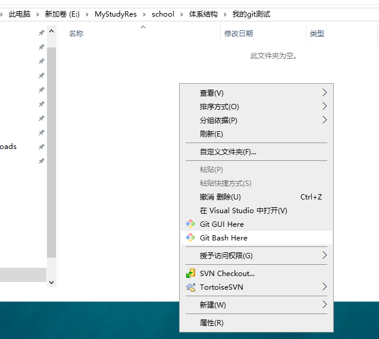

# 实验目的

1. git的安装
2. 学习git的基本使用

# 实验平台

* window10

# 实验前准备

1. [git下载](https://git-scm.com/download/win)
2. [git官方文档](https://git-scm.com/doc)使用教程

# 实验内容

## 一、git安装流程

* 去官网下载git


* 下载后开始进入安装的界面


* 安装路径


* 选择安装组件


* 选择菜单文件夹


* 修改系统的环境变量


* SSL证书选择


* 配置行尾结束符


* 配置终端仿真


* 其他配置默认即可

## 二、git的使用

### 1、git的使用测试

* 创建一个‘我的git测试’文件夹

* 右键选择Git Bash Here

  

* 输入命令git -- version，显示目前安装的git版本，说明git安装成功

  

### 2、运行git前的配置

* 安装完 Git 之后，要做的第一件事就是设置用户名和邮件地址。


* 使用git init初始化仓库，该命令将创建一个名为.git的子目录


* 创建gitignore文件，并在文件里输入要忽略的文件夹及其文件


### 3、基本命令使用

#### （1）add命令

此命令使用工作树中找到的当前内容更新索引，为下一次提交准备暂存的内容。相关的命令如下（[详细参数说明](https://git-scm.com/docs/git-add)）：

```
git add [--verbose | -v] [--dry-run | -n] [--force | -f] [--interactive | -i] [--patch | -p]
	  [--edit | -e] [--[no-]all | --[no-]ignore-removal | [--update | -u]]
	  [--intent-to-add | -N] [--refresh] [--ignore-errors] [--ignore-missing] [--renormalize]
	  [--chmod=(+|-)x] [--pathspec-from-file=<file> [--pathspec-file-nul]]
	  [--] [<pathspec>…]
```

* 添加gitignore文件


#### （2）status命令

显示在索引文件和当前头提交之间有差异的路径，在工作树和索引文件之间有差异的路径，以及在工作树中没有被Git跟踪的路径。相关的命令如下（[详细参数说明](https://git-scm.com/docs/git-status)）：

```
git status [<options>…] [--] [<pathspec>…]
```

* 查询状态


#### （3）commit 命令

创建一个新的提交，其中包含索引的当前内容和描述更改的给定日志消息。相关命令如下（[详细参数说明](https://git-scm.com/docs/git-commit)）：

```
git commit [-a | --interactive | --patch] [-s] [-v] [-u<mode>] [--amend]
	   [--dry-run] [(-c | -C | --fixup | --squash) <commit>]
	   [-F <file> | -m <msg>] [--reset-author] [--allow-empty]
	   [--allow-empty-message] [--no-verify] [-e] [--author=<author>]
	   [--date=<date>] [--cleanup=<mode>] [--[no-]status]
	   [-i | -o] [--pathspec-from-file=<file> [--pathspec-file-nul]]
	   [-S[<keyid>]] [--] [<pathspec>…]
```


### 4、git分支管理

#### （1）branch命令

使用此命令可以进行列出、创建或删除分支等操作，相关的命令如下（[详细参数说明](<https://git-scm.com/docs/git-branch>)）：

```
git branch [--color[=<when>] | --no-color] [--show-current]
	[-v [--abbrev=<length> | --no-abbrev]]
	[--column[=<options>] | --no-column] [--sort=<key>]
	[(--merged | --no-merged) [<commit>]]
	[--contains [<commit]] [--no-contains [<commit>]]
	[--points-at <object>] [--format=<format>]
	[(-r | --remotes) | (-a | --all)]
	[--list] [<pattern>…]
git branch [--track | --no-track] [-f] <branchname> [<start-point>]
git branch (--set-upstream-to=<upstream> | -u <upstream>) [<branchname>]
git branch --unset-upstream [<branchname>]
git branch (-m | -M) [<oldbranch>] <newbranch>
git branch (-c | -C) [<oldbranch>] <newbranch>
git branch (-d | -D) [-r] <branchname>…
git branch --edit-description [<branchname>]
```

* 列出所有分支


* 创建origin分支


* 删除分支


#### （2）checkout命令

切换分支或还原工作树文件，相关的命令如下（[详细参数说明](https://git-scm.com/docs/git-checkout)）：

```
git checkout [-q] [-f] [-m] [<branch>]
git checkout [-q] [-f] [-m] --detach [<branch>]
git checkout [-q] [-f] [-m] [--detach] <commit>
git checkout [-q] [-f] [-m] [[-b|-B|--orphan] <new_branch>] [<start_point>]
git checkout [-f|--ours|--theirs|-m|--conflict=<style>] [<tree-ish>] [--] <pathspec>…
git checkout [-f|--ours|--theirs|-m|--conflict=<style>] [<tree-ish>] --pathspec-from-file=<file> [--pathspec-file-nul]
git checkout (-p|--patch) [<tree-ish>] [--] [<pathspec>…]
```

* 创建一个testing分支并切换到该分支下


#### （3）merge命令

将两个或多个开发历史连接在一起，相关命令如下（[详细参数说明](https://git-scm.com/docs/git-merge)）：

```
git merge [-n] [--stat] [--no-commit] [--squash] [--[no-]edit]
	[--no-verify] [-s <strategy>] [-X <strategy-option>] [-S[<keyid>]]
	[--[no-]allow-unrelated-histories]
	[--[no-]rerere-autoupdate] [-m <msg>] [-F <file>] [<commit>…]
git merge (--continue | --abort | --quit)
```

* 在master分支下创建test.txt文件并输入一些内容，然后提交


* 创建并切换到testing分支


* 修改test.txt文件内容并提交


* 切换回master分支，并查看文件在工作目录与暂存区的差别


* 使用merge命令合并冲突


### 课后作业1：添加远程仓库

1. 首先创建备份的目录

   

2. 进入该目录,右键选择Git Bash Here

   

3. 输入命令: git --bare init 回车

   

   *有关git init和git --bare init的区别参考以下链接*
   [git init 和git –bare init 的具体区别？](http://blog.haohtml.com/archives/12265)

4. 进入需要备份的目录右键Git Bash Here

   

5. 输入命令: git remote add backup <url> 回车, 即可创建一个远程分支

   

6. 接着输入命令: git push backup master 回车, 即可将master分支推送到远程分支backup, 完成备份

   

# 实验总结

​	以前在团队开发中使用过集中化的版本控制系统svn，相比于git这种版本控制有着显而易见的缺点就是中心数据库所在的磁盘发生损坏，又没有做恰当备份，毫无疑问将丢失所有数据——包括项目的整个变更历史，只剩下人们在各自机器上保留的单独快照。

​	于是分布式版本控制系统如git面世了。 客户端并不只提取最新版本的文件快照， 而是把代码仓库完整地镜像下来，包括完整的历史记录。 这么一来，任何一处协同工作用的服务器发生故障，事后都可以用任何一个镜像出来的本地仓库恢复。 因为每一次的克隆操作，实际上都是一次对代码仓库的完整备份。

​	通过本次实验我深刻体会到了git版本控制的好处，在实验中掌握了git的基本和高级使用，熟悉使用git命令和git gui进行版本控制。通过理论和实践相结合，进一步提升了我的实践实力和查找资料的能力，让我受益匪浅。


