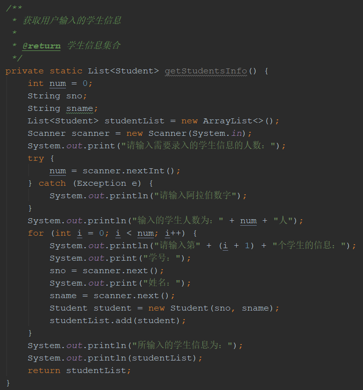
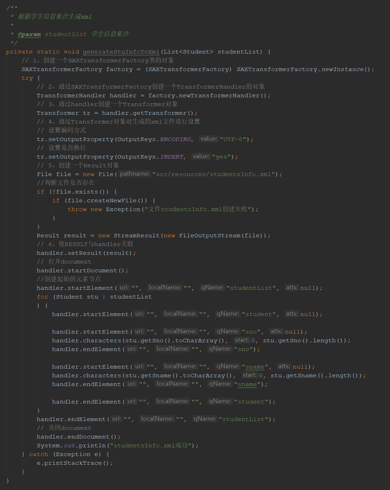
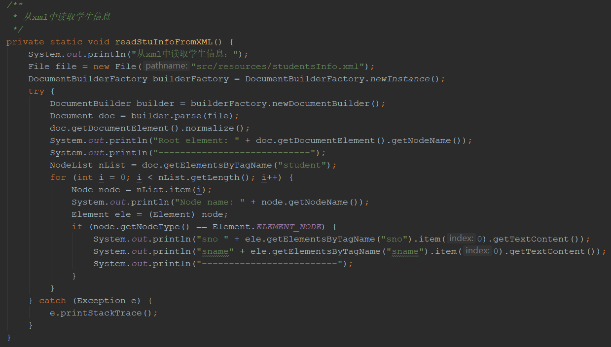
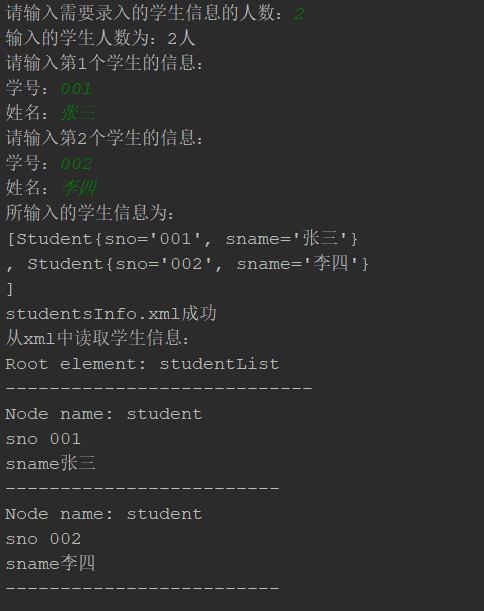
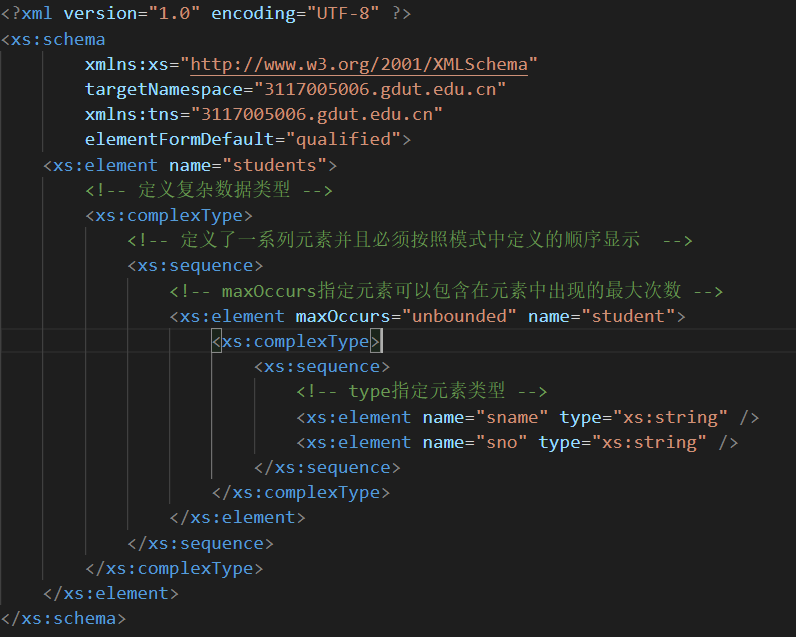
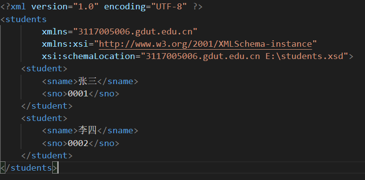

# xml学习

## 使用java语言对xml操作

### 获取输入的学生信息

### 使用java sax生成xml文件

### 使用java sax读取xml文件

### 运行结果

## 使用熟悉的编辑器编辑xml

### 创建xml schema文件

> 1. xmlns:xs="http://www.w3.org/2001/XMLSchema"：表示 schema 中用到的元素和数据类型来自命名空间 "http://www.w3.org/2001/XMLSchema"。同时它还规定了来自命名空间 "http://www.w3.org/2001/XMLSchema" 的元素和数据类型应该使用前缀 xs
> 2. targetNamespace：显示被此 schema 定义的元素均来自命名空间3117005006.gdut.edu.cn
> 3. elementFormDefault：qualified指出任何 XML 实例文档所使用的且在此 schema 中声明过的元素必须被命名空间限定。

### 在xml中引入xsd约束

> 1. xmlns="3117005006.gdut.edu.cn"规定了默认命名空间的声明。此声明会告知 schema 验证器，在此 XML 文档中使用的所有元素都被声明于这个命名空间。
> 2. xmlns:xsi="http://www.w3.org/2001/XMLSchema-instance" ：一旦您拥有了可用的 XML Schema 实例命名空间。您就可以使用 schemaLocation 属性了。此属性有两个值。第一个值是需要使用的命名空间。第二个值是供命名空间使用的 XML schema 的位置