# JavaEE学习

## 使用IDEA创建**dynamic web project** 

参考博客：[IDEA 创建 动态 Web 项目的正确姿势](https://www.jianshu.com/p/9fb68b6b7a93)

1. **打开 IDEA，点击 Create New Project**

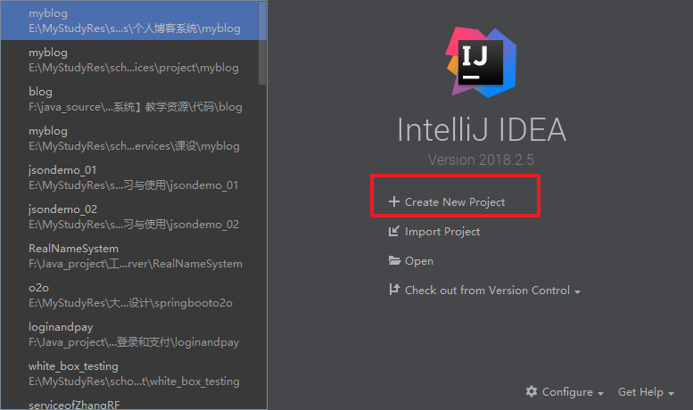

2. **左侧选中Java Enterprise，Java EE version 下拉框选择 Java 7**

解释一下，这里选择 Java 7 是为了解决一个 IDEA 在创建动态 Web 项目流程上的小 Bug。

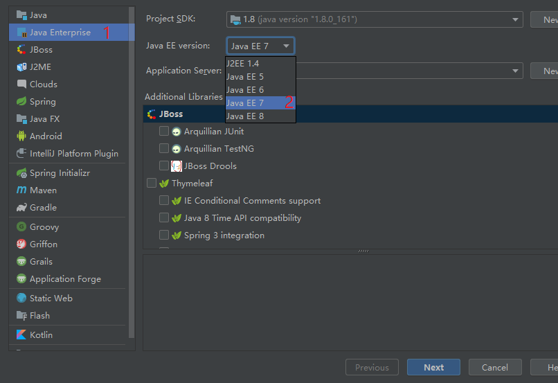

3. **左侧选中 Java，然后再选中回 Java Enterprise，Java EE version 下拉框选择 Java 8，选择项目其他相应信息**

如果没有上面切换 Java EE version 的操作，那么这一步在选中 Web Application 时，下方不会有创建 web.xml 选择框


4. **点击 Next，填写 Project name**

在填写 Project name 时，IDEA 会自动补全其它信息，节省了我们的时间

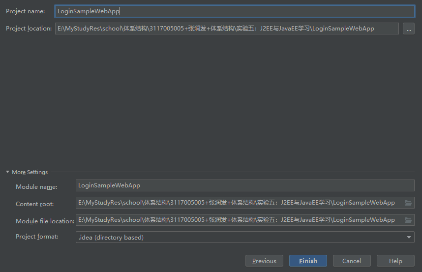

5. **点击 Finish，进入 IDEA 主界面**

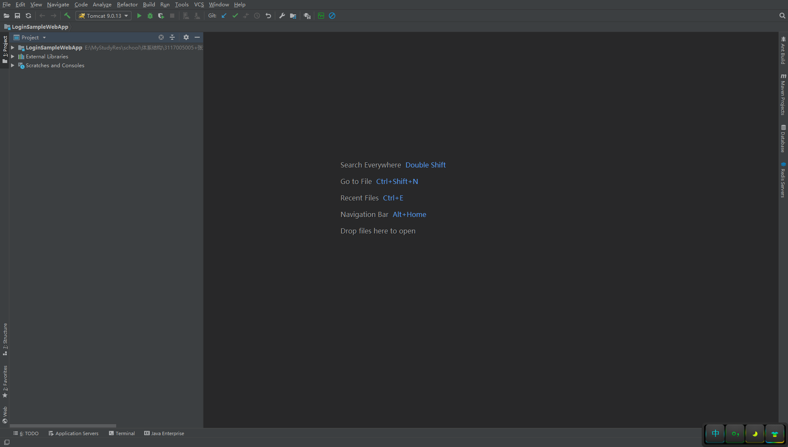

6. **选中项目根目录，按 F4 或者 file -> Project structure**

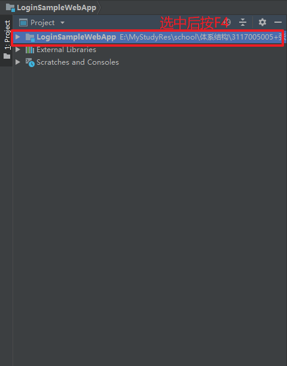

7. **右键点击 WEB-INF，创建 classes 和 lib 文件夹**

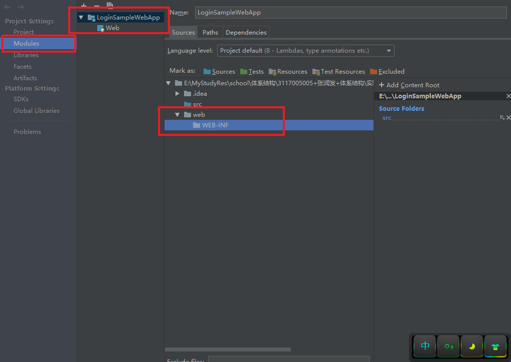

8. **设置编译输出路径为 classes 文件夹**

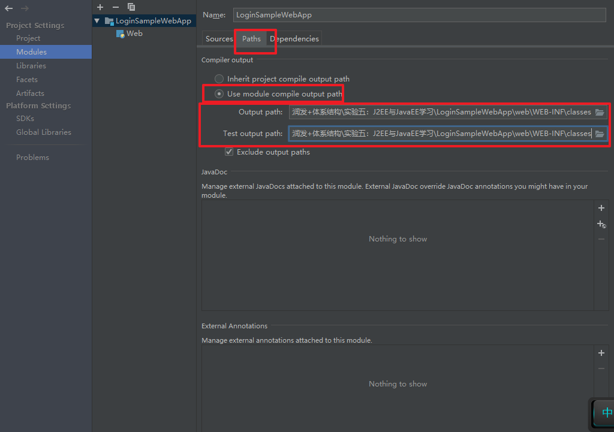

9. **将 lib 文件夹添加到项目 jar 包依赖中**

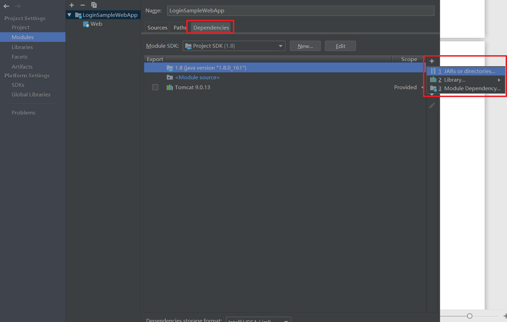

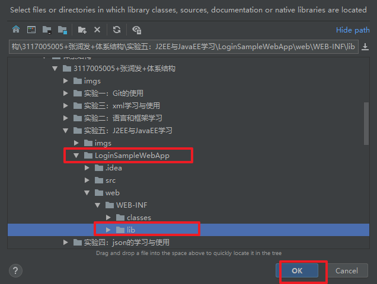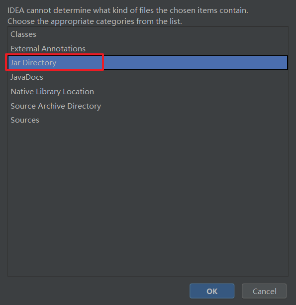

10. **点击 OK 设置结束**

注意，此时在将外部 jar 包放进 lib 时，打开 Project structure 会有一个 problem


## IDEA配置tomcat

- **点击IDEA上面的edit configurations..配置本地tomcat**

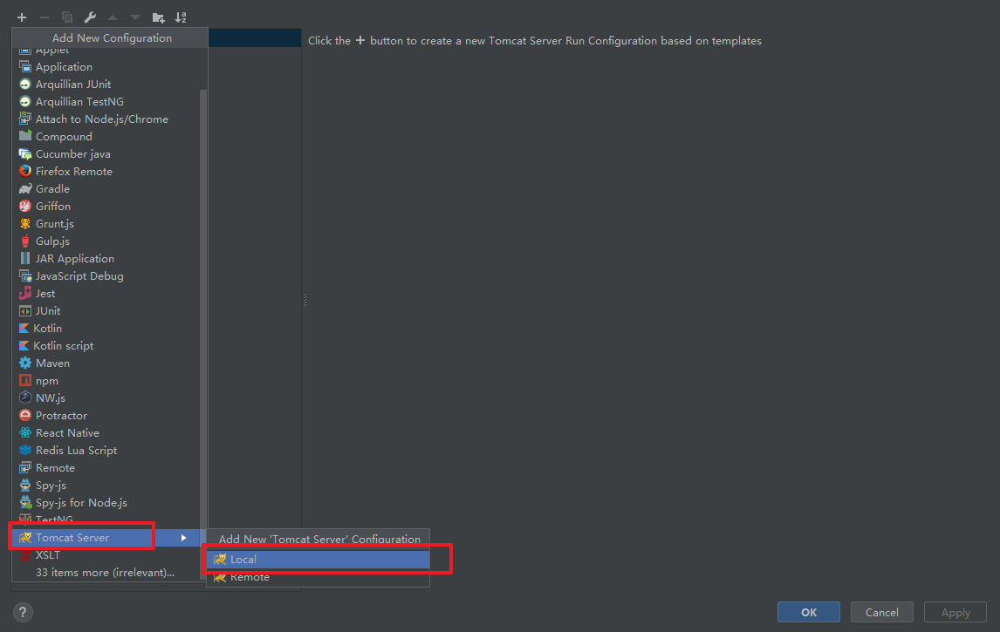

- **配置local tomcat的service页面，截图如下**

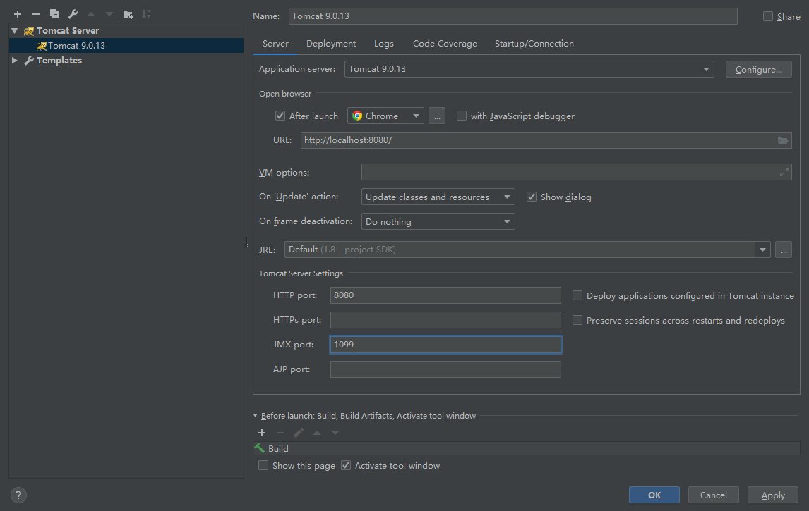

- **配置local tomcat的Deployment页面，截图如下**

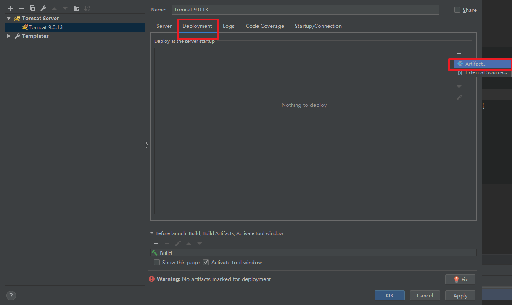


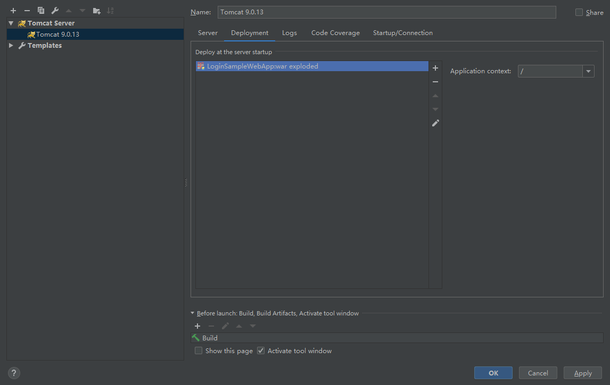

到此为止配置完成！

## 运行测试

- **创建index.jsp，并输入一下内容**

```jsp
<%@ page contentType="text/html;charset=UTF-8" language="java" pageEncoding="UTF-8" %>
<!DOCTYPE html PUBLIC "-//W3C//DTD HTML 4.01 Transitional//EN" "http://www.w3.org/TR/html4/loose.dtd">
<html>
<head>
    <meta http-equiv="Content-Type" content="text/html;charset=UTF-8">
    <title>login</title>
</head>
<%
    String errMsg = null; //first check whether the form was submitted
    if ("POST".equalsIgnoreCase(request.getMethod()) && request.getParameter("submit") != null) { //form was submitted
        String userName = request.getParameter("userName");
        String password = request.getParameter("password");
        if ("admin".equalsIgnoreCase(userName) && "admin".equalsIgnoreCase(password)) {
            //valid user
            out.println("Welcome admin !");
            return;
        } else {
            errMsg = "Invalid user id or password. Please try again";
        }
    }
%>
<body>
<h2>Login:</h2>
<!-- Check error message. If it is set, then display it -->
<%if (errMsg != null) { %>
    <span style="color: red;"><%out.print(errMsg); %></span>
<%} %>
<form method="post"> User Name: <input type="text" name="userName"><br>
    Password: <input type="password" name="password"><br>
    <button type="submit" name="submit">Submit</button>
    <button type="reset">Reset</button>
</form>
</body>
</html>

```

- 运行tomcat服务器

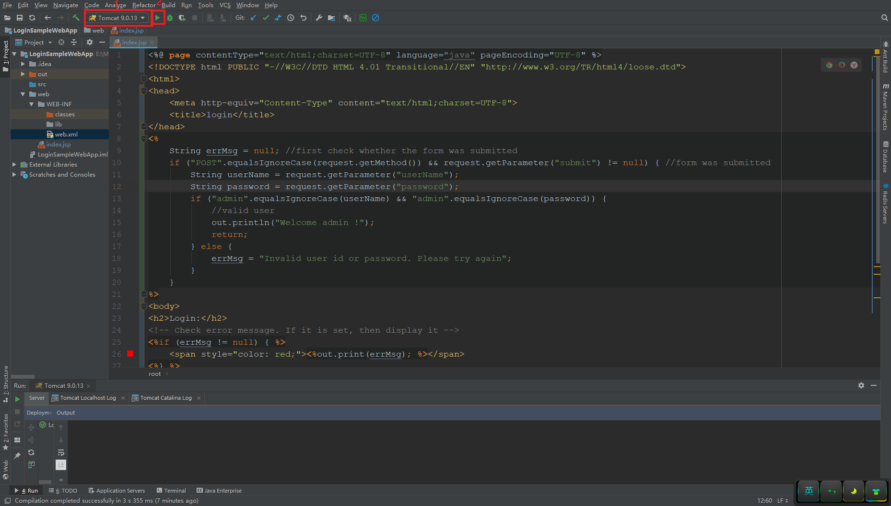

- **在浏览器中输入<http://localhost:8080/>，可以看到登录页面**

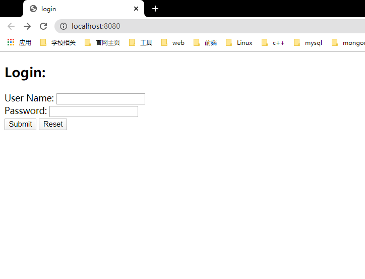

- **输入用户名：admin，密码：admin，提交后登录成功跳转到欢迎页**

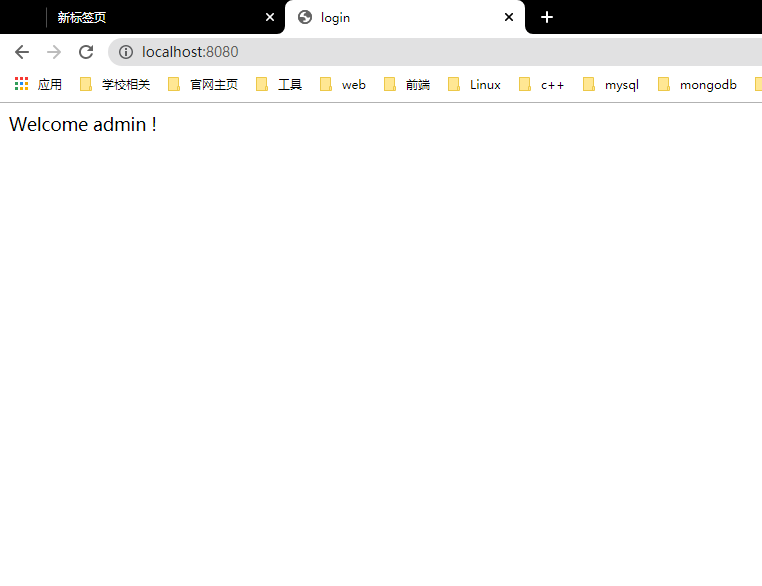

- **否则提示用户名或密码错误**

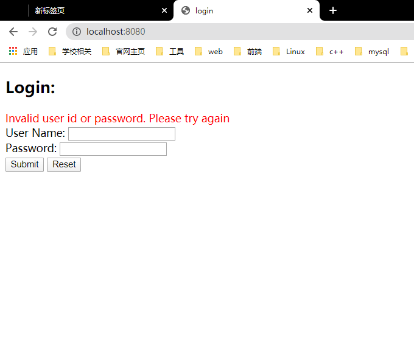