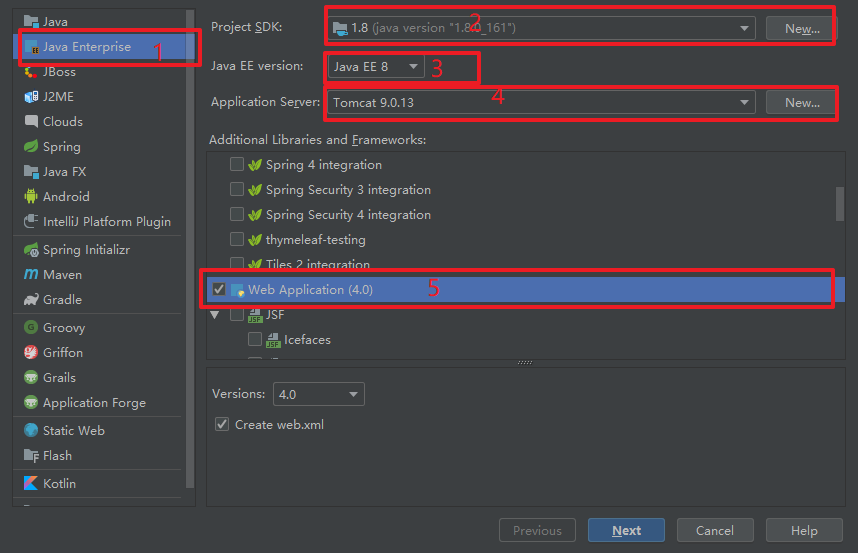

# JavaEE学习

## 使用IDEA创建**dynamic web project** 

参考博客：[IDEA 创建 动态 Web 项目的正确姿势](https://www.jianshu.com/p/9fb68b6b7a93)

### 打开 IDEA，点击 Create New Project

### 左侧选中Java Enterprise，Java EE version 下拉框选择 Java 7

解释一下，这里选择 Java 7 是为了解决一个 IDEA 在创建动态 Web 项目流程上的小 Bug。

### 左侧选中 Java，然后再选中回 Java Enterprise，Java EE version 下拉框选择 Java 8，选择项目其他相应信息

如果没有上面切换 Java EE version 的操作，那么这一步在选中 Web Application 时，下方不会有创建 web.xml 选择框

### 点击 Next，填写 Project name

在填写 Project name 时，IDEA 会自动补全其它信息，节省了我们的时间

### 点击 Finish，进入 IDEA 主界面

### 选中项目根目录，按 F4 或者 file -> Project structure

### 右键点击 WEB-INF，创建 classes 和 lib 文件夹

### 设置编译输出路径为 classes 文件夹

### 将 lib 文件夹添加到项目 jar 包依赖中

### 点击 OK 设置结束

注意，此时在将外部 jar 包放进 lib 时，打开 Project structure 会有一个 problem

